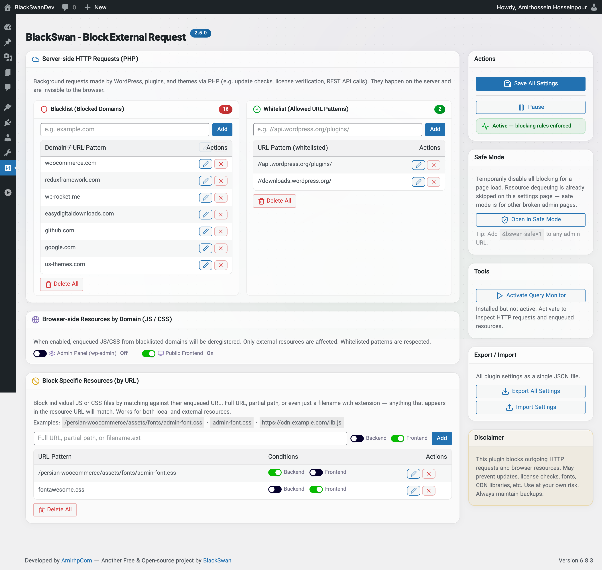

## BlackSwan | Block External Request
Take control of every outgoing connection your WordPress site makes.<br>
Block unwanted HTTP requests, dequeue external JS/CSS, and speed up your admin panel.


[AmirhpCom](https://amirhp.com/landing/) ·
[BlackSwan](https://blackswandev.com/) ·
[Rate 5-Star](https://wordpress.org/support/plugin/blackswan-block-external-request/reviews/#new-post) ·
[Support & Issues](https://wordpress.org/support/plugin/blackswan-block-external-request/) ·
Get from [WordPress.org](https://wordpress.org/plugins/blackswan-block-external-request/)

## Screenshot



---

## What it does

WordPress, plugins, and themes constantly send background HTTP requests — update checks, license pings, analytics, font downloads, CDN calls. On slow servers or restricted hosting, these add **seconds** to every admin page load.

This plugin gives you three layers of control:

| Layer | What it blocks | How |
|-------|---------------|-----|
| **Server-side HTTP (PHP)** | Background `wp_remote_*` requests | `pre_http_request` filter with domain blacklist/whitelist |
| **Browser-side by Domain** | External JS/CSS from blacklisted domains | Deregisters enqueued assets at priority 9999 |
| **Specific Resources** | Individual JS/CSS files by URL pattern | Matches full URL, partial path, or filename — local or external |

## Features

- **Blacklist & Whitelist** — add, edit, delete domains inline; delete all with one click
- **Resource blocking** — separate toggles for admin panel and public frontend
- **Specific resource blocking** — per-item backend/frontend checkboxes
- **Pause/Resume** — one-click toggle, instantly disables all blocking via AJAX
- **Safe Mode** — append `?bswan-safe=1` to any admin URL for emergency bypass
- **Auto-bypass** — settings page skips resource dequeuing so you never lock yourself out
- **Export/Import** — all settings as a single JSON file
- **Query Monitor integration** — detect, activate, or install directly from settings
- **Zero dependencies** — inline Lucide SVG icons, no external CSS/JS/fonts
- **Single option storage** — all settings in one JSON `wp_option` with `autoload=no`
- **Liquid glass UI** — frosted postboxes, dot-grid background, gradient badges
- **Translation-ready** — full `__()` / `_e()` text domain support

## Installation

### From WordPress Admin

1. Go to **Plugins → Add New**
2. Search for **"BlackSwan Block External Request"**
3. Click **Install Now** → **Activate**
4. Go to **Settings → Block External Request**

### Manual

1. Download the [latest release](https://github.com/blackswandevcom/blackswan-block-external-request/releases)
2. Upload the `blackswan-block-external-request` folder to `/wp-content/plugins/`
3. Activate via **Plugins** menu
4. Configure at **Settings → Block External Request**

## Safe Mode

If you accidentally block something that breaks your admin panel:

```
https://yoursite.com/wp-admin/options-general.php?page=bswan-ber-settings&bswan-safe=1
```

This bypasses **all** blocking rules for that page load. The settings page also automatically skips resource dequeuing (but not HTTP blocking) as an extra safety net.

## Filters

Developers can modify the blacklist and whitelist programmatically:

```php
// Add domains to blacklist
add_filter('BlackSwan\block_external_request\block_url_list', function($list) {
    $list[] = 'analytics.example.com';
    return $list;
});

// Add patterns to whitelist
add_filter('BlackSwan\block_external_request\whitelist_urls', function($list) {
    $list[] = '//api.example.com/v2/';
    return $list;
});
```

## Changelog

### 2.6.0
- Liquid glass UI with frosted postboxes and dot-grid background
- Inline Lucide SVG icons — fully standalone, zero external dependencies
- Status badge with animated icons (activity pulse / circle-pause)
- Query Monitor three-state detection with one-click activate
- Gradient badges and refined visual language

### 2.5.0
- Replaced all dashicons with inline Lucide SVGs
- Plugin is fully standalone — no external resources loaded

### 2.4.0
- Query Monitor: detect active, installed, or missing; one-click activate

### 2.3.x
- Safe mode (`?bswan-safe=1`) for emergency bypass
- Settings page auto-bypasses resource blocking
- Native WordPress collapsible postboxes

### 2.2.0
- Block Specific Resources — by full URL, partial path, or filename
- WordPress post-editor two-column layout with sidebar metaboxes
- Global export/import (single JSON file)

### 2.1.0
- Browser-side resource blocking (JS/CSS by domain)
- Separate backend/frontend toggles

### 2.0.0
- Complete rewrite with visual settings page
- Blacklist/whitelist management, AJAX save, pause/resume
- JSON export/import, Query Monitor link
- Single JSON option with `autoload=no`

### 1.1.0
- Added whitelist support

### 1.0.0
- Initial release — domain-based HTTP request blocking

## Copyright & License

**Copyright (c) [AmirhpCom](https://amirhp.com/)** — All rights reserved.

Developed and maintained by **[BlackSwan Lab](https://blackswandev.com/)**.

This plugin is free software distributed under the **GNU General Public License v2 or later**. You are free to use, modify, and distribute it under the terms of the GPLv2.

The developers are not responsible for any issues caused by misconfigured blocking rules. Always maintain proper backups.

---

<p align="center">
  <sub>Made with ☕️ + 💻 + 🧠 + 🤖 + ♥️ by <a href="https://amirhp.com/">AmirhpCom</a> at <a href="https://blackswandev.com/">BlackSwan</a></sub>
</p>
